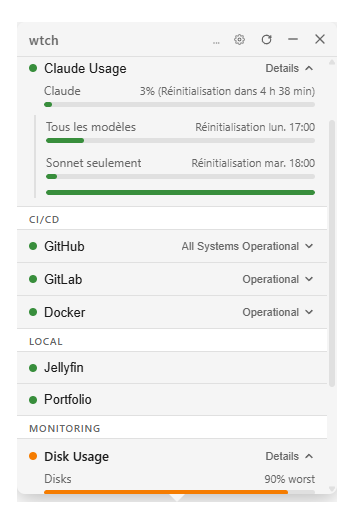

# wtch

A lightweight system tray app for monitoring the status of cloud services, built with [Tauri](https://tauri.app/) and [Vue](https://vuejs.org/).



Click the tray icon to see the status of your services at a glance. Expand any service to view individual component health. Get notified when something goes down.

## Features

- System tray app with popup panel
- 375+ built-in service presets (GitHub, AWS, GCP, OpenAI, Snowflake, ...)
- Expandable details per service (components, regions, sub-services)
- Desktop notifications on status changes
- Light and dark themes
- Custom watches via YAML config (HTTP, script, adapter)

## Getting started

```sh
npm install
make dev
```

See [docs/configuration.md](docs/configuration.md) for config examples and adapter details.

## Contributing

Found a bug? Missing a service preset? [Open an issue](https://github.com/ysaunier/wtch/issues).

## Acknowledgements

Inspired by [stts](https://github.com/inket/stts) by [@inket](https://github.com/inket). Thank you for the inspiration.

## Author

[Yoann Saunier](https://ysaunier.dev/) - [@ysaunier](https://github.com/ysaunier)

<a href="https://buymeacoffee.com/ysaunier" target="_blank"></a>

## License

[MIT](LICENSE) - Yoann Saunier
